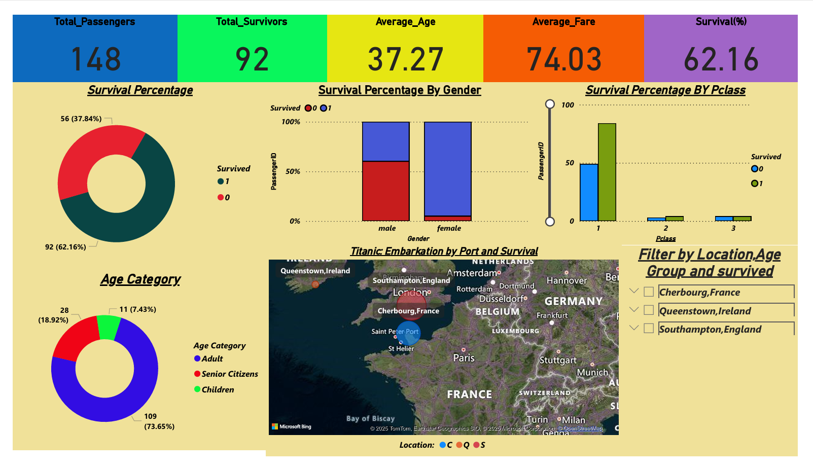

readme_content = """
# 🚢 Titanic Dataset - Power BI Dashboard

This repository presents an interactive **Power BI Dashboard** built on the historical **Titanic dataset**. The dashboard helps visualize survival patterns, demographic distributions, and embarkation details of Titanic passengers.



---

## 📊 Dashboard Summary

The dashboard provides insights into:

- **Total Passengers**: 148  
- **Survivors**: 92 (62.16%)  
- **Average Age**: 37.27 years  
- **Average Fare**: $74.03

---

## 📌 Key Visualizations

### 🧑‍🤝‍🧑 Survival Analysis
- Donut chart showing survival distribution (62% survived).
- Survival rates by **Gender**: Higher survival for females.
- Survival rates by **Passenger Class**: 1st class had the highest survival.

### 👶 Age Category
- Majority passengers were **Adults** (74%).
- Smaller portions were **Children** and **Senior Citizens**.

### 🌍 Embarkation Map
- Interactive map shows ports (Cherbourg, Queenstown, Southampton).
- Port-based survival filtering enabled.

### 🧩 Filters
- Dynamic slicers to filter by **Location**, **Age Group**, and **Survival Status**.

---

## 📁 Files

```bash
📁 titanic-powerbi-dashboard/
├── TitanicDashboard.pbix        # Power BI dashboard file
├── Titanic.png                  # Dashboard screenshot
├── data/
│   └── titanic.csv              # Titanic dataset (if included)
└── README.md                    # Project documentation
